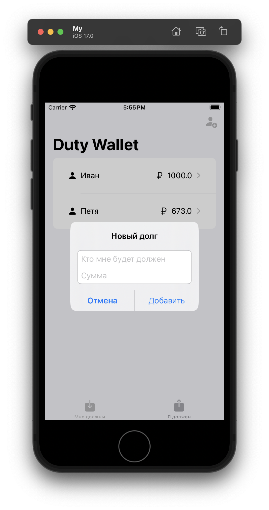

# Duty Wallet

<div align="center">
    
</div>


This app stores your debts and loans, with extensible repository pattern on Realm

<div style="display: flex; flex-direction: row; flex-wrap: wrap; justify-content: center; column-gap: 24px; row-gap: 20px;">
  <span></span>
</div>

## Структура проекта

```
DutyWallet
├── System
│   └── DutyWalletApp
│
├── Repository
│   ├── Entity
│   │   └── ...
│   ├── RepositoryProtocol
│   └── RealmRepository
│
├── UI
│   ├── Component
│   │   └── ...
│   └── Screen
│       ├── View
│       │   └── ...
│       └── ViewModel
│           └── ...
│
├── Model
│
└── ...   <- Extensions, Utilities and Resourses
```

## Технологии и инструменты

- [SwiftUI](https://developer.apple.com/xcode/swiftui/)
- [Realm](https://realm.io/realm-swift/)
- [Repository Pattern](https://habr.com/ru/articles/248505/)
